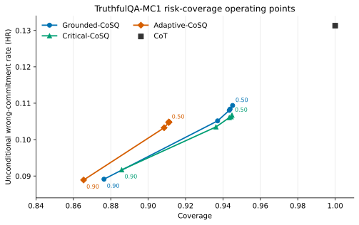

# CoSQ: Chain-of-Self-Questioning

[](https://pypi.org/project/cosq/)
[](https://pypi.org/project/cosq/)
[](https://github.com/senolali/CoSQ/actions/workflows/ci.yml)
[](LICENSE)

CoSQ is a reproducible framework for **selective factual answering** with large
language models. Before committing to an answer, the model decomposes the
question into required information, evaluates item-level confidence, and either
answers from accepted facts or abstains. The aim is not maximum answer volume;
it is explicit, measurable control over when a model should answer.

This repository accompanies:

> **When Should Large Language Models Abstain? Chain-of-Self-Questioning for
> Selective Risk Control**

The paper has been submitted to arXiv: https://arxiv.org/abs/2609.17516

## Why CoSQ?

In high-consequence settings, a confident wrong answer may be more harmful than
a referral. A clinical decision-support system, for example, should route a
case to a specialist when the evidence needed to answer is uncertain. CoSQ
turns this behavior into a tunable operating policy and reports the resulting
answered accuracy, coverage, and unconditional wrong-commitment rate together.

## Method

CoSQ separates model calls, parsing, decisions, scoring, and reporting:

1. **Information decomposition.** The model lists the information needed to
   answer the question. Role-aware variants distinguish `CRITICAL` from
   `SUPPORTING` information.
2. **Grounded confidence.** For each item, the model generates a factual claim
   and a confidence score from 0 to 100. Structured parsers read only labelled
   fields and retain the raw completion for audit.
3. **Selective commitment.** A decision rule evaluates the item scores. If the
   gate passes, the model answers from threshold-accepted facts; otherwise it
   returns an explicit abstention.

### Implemented variants

- **Grounded-CoSQ** applies an aggregate confidence gate to all required items
  and conditions the final answer on accepted facts.
- **Critical-CoSQ** asks which items are indispensable and applies the gate to
  that critical subset.
- **Adaptive-CoSQ** combines overall confidence, critical-item mean and minimum
  checks, response mode selection, and a final contradiction check.

The package also provides Direct and CoT controls, plus an optional
abstention-aware CoT strategy. In the paper protocol, Direct and CoT are genuine
forced-choice controls: they are not offered abstention, and malformed output is
scored as wrong.

## Paper protocol and results

The primary experiment uses all 817 TruthfulQA-MC1 questions, 11 models,
balanced correct-option positions (seed 1002), and 17 conditions: Direct, CoT,
and the three CoSQ variants at mean-confidence thresholds from 0.50 to 0.90.
The exact option presentation is hashed into every run manifest.

Macro means across the 11-model panel at the principal 0.90 operating point:

| Condition | Answered accuracy | Coverage | Wrong-commitment rate |
| --- | ---: | ---: | ---: |
| Direct | 0.872 | 1.000 | 0.128 |
| CoT | 0.869 | 1.000 | 0.131 |
| Grounded-CoSQ | **0.897** | 0.876 | 0.089 |
| Critical-CoSQ | 0.896 | **0.886** | 0.092 |
| Adaptive-CoSQ | 0.896 | 0.865 | **0.089** |

Compared with CoT, Grounded-CoSQ reduced the unconditional wrong-commitment
rate by 0.042 and increased answered accuracy by 0.029 on average; all 11 models
moved in the expected direction in both paired comparisons. Coverage is an
operating characteristic rather than a failure measure: an abstention is the
intended action when evidence is insufficient.

The 300-question, five-model NQ-Short panel provides a secondary open-answer
generalization check. Grounded-CoSQ increased mean answered accuracy from 0.588
for CoT to 0.670 while routing 17.0% of questions to abstention.

Aggregate tables and reproducible figure generation are under [`paper/`](paper/README.md).



## Installation

### PyPI

CoSQ requires Python 3.10 or newer:

```bash
python -m pip install --upgrade cosq
cosq --version
cosq list
```

The installed package can be tested immediately without an API key:

```bash
cosq ask "Which planet is known as the Red Planet?" --model mock --option Earth --option Mars --option Venus
```

### Source checkout

Clone the repository to obtain the paper configurations, tests, and figure
scripts:

```bash
git clone https://github.com/senolali/CoSQ.git
cd CoSQ
python -m venv .venv
```

Activate the environment:

```powershell
# Windows PowerShell
.\.venv\Scripts\Activate.ps1
```

```bash
# macOS/Linux
source .venv/bin/activate
```

Install the framework and development tools:

```bash
python -m pip install -e ".[dev]"
```

Optional integrations are installed only when needed:

```bash
python -m pip install -e ".[hf]"      # local Hugging Face inference and datasets
python -m pip install -e ".[openai]"  # OpenAI API integration
python -m pip install -e ".[paper]"   # regenerate public paper figures
```

## Network-free end-to-end test

The mock backend exercises execution, caching, evaluation, analysis, and report
generation without a network request or model credential:

```bash
cosq run --config configs/experiment/smoke_mock.yaml --backend mock
```

The command prints a run directory. Use it for offline processing:

```bash
cosq evaluate results/runs/<RUN_DIR>
cosq analyze results/runs/<RUN_DIR>
cosq report results/runs/<RUN_DIR>
```

Run `cosq --help` or `cosq <command> --help` for all CLI options.

## Run the paper protocol

First configure a model. Public examples are in [`configs/model/`](configs/model/).
The Hugging Face examples require an immutable model revision; API credentials
belong in environment variables or an ignored `.env` file.

Probe the selected model before starting a campaign:

```bash
cosq probe --model configs/model/openai_template.yaml
```

Run the 30-question protocol check:

```bash
cosq run --config configs/experiment/pilot_truthfulqa_mc.yaml --model configs/model/openai_template.yaml --cache results/cache.sqlite --workers 4
```

Run the complete 817-question, 17-condition protocol after validating the pilot:

```bash
cosq run --config configs/experiment/paper_truthfulqa_mc.yaml --model configs/model/openai_template.yaml --cache results/cache.sqlite --workers 4
```

Use a worker count appropriate for the model host and its rate limits. Local GPU
inference commonly performs best with one worker. Add `--allow-dirty` only when
you intentionally run from a checkout with uncommitted protocol changes; the
manifest records that state.

## Balanced option positions

Generative multiple-choice evaluation is vulnerable to label-position bias. Set
the following in an experiment configuration:

```yaml
data:
  name: truthfulqa_mc1
  n: 817
  seed: 1002
  option_order: balanced
  option_seed: 1002
```

CoSQ deterministically permutes the options while preserving the gold content,
balances the correct label separately for each option count, and stores both
`ids_sha256` and `options_sha256` in `manifest.json`. A sufficiently large
multiple-choice run with a degenerate answer-position key is rejected before
inference starts.

## Caching and offline analysis

Identical model calls are cached in SQLite:

```bash
cosq run --config configs/experiment/pilot_truthfulqa_mc.yaml --model configs/model/openai_template.yaml --cache results/cache.sqlite
```

The cache key includes model identity, model revision, generation parameters,
prompt text, and repeat. Re-running an unchanged protocol reuses the raw
completion. Changing option order changes the prompt and therefore correctly
creates a different cache entry.

Each run stores:

- `config.resolved.yaml`: exact resolved protocol;
- `manifest.json`: model, environment, Git state, prompt digest, dataset ID hash,
  and option-presentation hash;
- `records.jsonl`: raw prompts, completions, parsed decisions, and traces;
- `metrics.json` and `stats.json`: generated by offline evaluation and analysis.

## Metrics

For `N` questions, `C` correct commitments, `W` wrong commitments, and `A`
abstentions:

| Metric | Definition | Interpretation |
| --- | --- | --- |
| Answered accuracy (AA) | `C / (C + W)` | Accuracy among committed answers |
| Coverage | `(C + W) / N` | Fraction answered |
| Wrong-commitment rate (HR) | `W / N` | Unconditional rate of wrong answers |
| Abstention rate (AR) | `A / N` | Fraction routed away from answering |
| Answered risk | `W / (C + W)` | Error conditional on commitment; `1 - AA` |

Unparseable output is reported separately. For the forced-choice Direct and CoT
controls, output that violates the one-label contract is counted as wrong rather
than as an implicit abstention.

## Supported data adapters

- `truthfulqa_mc1`: TruthfulQA MC1, generation-then-match scoring;
- `nq_short`: short-answer Natural Questions;
- `mmlu`: MMLU subject or aggregate evaluation;
- `jsonl`: local custom datasets.

The optional `datasets` dependency downloads public benchmark data when a local
cache is absent. Dataset sampling is seeded, and the sampled question IDs are
hashed in the manifest.

## Reproduce the public figures

```bash
python -m pip install -e ".[paper]"
python scripts/plot_paper_results.py
```

The script reads only committed CSV files and writes SVG and PDF figures to
`paper/figures/`. No model call is made.

## Development

```bash
python -m pytest
python -m ruff check .
python -m mypy
python -m build
python -m twine check dist/*
```

The repository contains no provider credentials, private endpoints, response
caches, or provider-specific operational configuration. Copy [`.env.example`](.env.example)
to `.env` for local credentials and never commit that file.

## PyPI release through GitHub Actions

Releases use PyPI Trusted Publishing; no long-lived PyPI token is required.

1. Update the version in `pyproject.toml` and `src/cosq/__init__.py`.
2. Run the development checks above and push the commit.
3. On GitHub, open **Actions > Publish package to PyPI > Run workflow**.
4. The workflow runs tests and linting, builds both distributions, validates
   them with Twine, and publishes through the configured trusted publisher.

The PyPI publisher must use owner `senolali`, repository `CoSQ`, and workflow
`publish.yml`. Leave the environment field empty unless the workflow is later
changed to use a named GitHub environment.

## Citation

If you use CoSQ, please cite the accompanying paper:

```bibtex
@misc{senol2026cosq,
  author        = {Ali {\c{S}}enol},
  title         = {When Should Large Language Models Abstain? Chain-of-Self-Questioning for Selective Risk Control},
  year          = {2026},
  eprint        = {2609.17516},
  archivePrefix = {arXiv},
  primaryClass  = {cs.CL},
  url           = {https://arxiv.org/abs/2609.17516},
}
```

Replace `xxxx.xxxx` with the assigned arXiv identifier after approval. GitHub's
**Cite this repository** menu is backed by [`CITATION.cff`](CITATION.cff).
For reproducibility, also report the CoSQ version, model revision, dataset
version, confidence threshold, option seed, and cache policy.

## License

CoSQ is released under the [MIT License](LICENSE).
